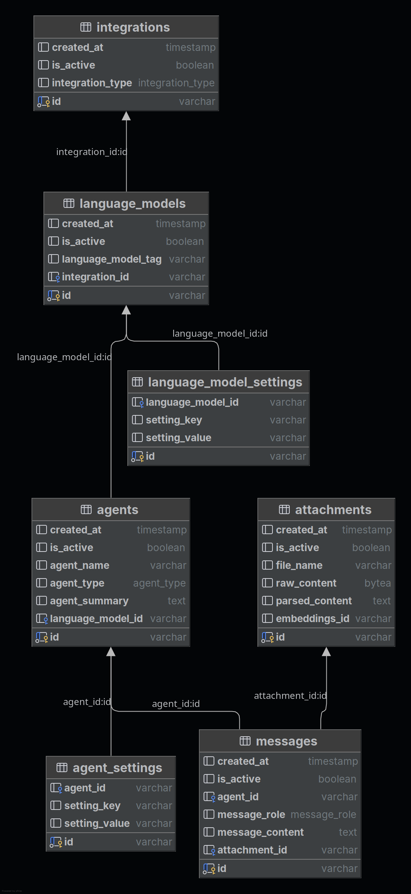

# Dev Guide

## Environment Setup

### Create a virtual environment

Create a virtual environment to isolate the dependencies:

```bash
python -m venv venv
source venv/bin/activate  # On Windows: venv\Scripts\activate
```

### Install dependencies

After activating the virtual environment, install the dependencies:

```bash
pip install -r requirements.txt
```

### Run tests

After installing the dependencies, run the tests to make sure everything is
working as expected:

```bash
make test
```

### Initialize pre-commit

If you plan to contribute to the codebase, it is recommended to install the
pre-commit hooks:

```bash
pre-commit install
```

---

## Running the Application

### Locally

```bash
uvicorn app.main:app --reload
```

Access the interactive documentation (OpenAPI):

- Swagger UI: [http://127.0.0.1:8000/docs](http://127.0.0.1:8000/docs)

---

## Project Structure

```plaintext
/
├── app
│   ├── application
│   ├── core
│   ├── domain
│   ├── infrastructure
│   ├── interfaces
│   ├── middleware
├── tests
    ├── integration
```

---

## Project Database Structure



---

## Contributing

We appreciate the support from the community and welcome any help to improve
this project. If you encounter any issues or have suggestions for enhancements,
please report them by creating an issue on
our [GitHub Issues](https://github.com/bsantanna/agent-lab/issues) page.

To contribute to the project, follow these steps:

1. Fork the repository.
2. Create a new branch for your feature or bugfix.
3. Activate the pre-commit hooks by running `pre-commit install`, make your
   changes, and commit them with clear and concise messages.
4. Ensure your changes pass the pre-commit hooks and achieve at least 80% test
   coverage in SonarQube.
5. Push your changes to your forked repository.
6. Create a Pull Request (PR) to the `main` branch of the original repository.

We will review your PR and provide feedback. Thank you for your contributions
and support!
