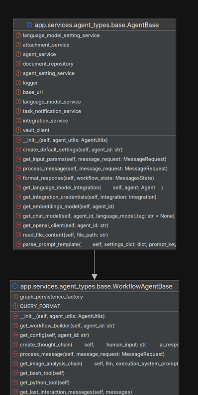
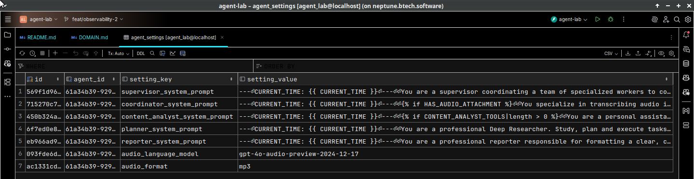

<h2 align="center"><a href="https://github.com/btech-software/agent-lab">Agent-Lab | 🤖🧪</a></h2>
<h3 align="center">Developer's Guide</h3>

---

#### Table of Contents
- [Two ways to develop](#two-ways-to-develop)
- [Setup](#setup)
- [Reference Implementation](#reference-implementation)
- [Running the Application](#running-the-application)
- [Development Practices](#development-practices)
- [Building agentic workflows](#building-agentic-workflows)
- [Extending the framework](#extending-the-framework)
- [Contributing](#contributing)
- [Production deployment](#production-deployment)

---

## Two ways to develop

Agent-Lab is a framework you consume as a library, and it is also a repository you
can work in directly. Both are supported:

- **As a library (recommended for products).** Add `btech-agent-lab` to your own
  project, define agents by extending the base classes, and assemble the app with
  `create_app()`. You extend the framework through its public API — subclassing,
  decorators and configuration — and never edit framework code. Start with the
  [Quickstart](../README.md#quickstart) and [Extending the framework](#extending-the-framework).
- **In-repo (for contributors and the reference implementation).** Clone the
  repository and add agents under `agent_lab/services/agent_types/`, run the bundled
  reference app, and use the notebooks and integration tests. This is how the
  built-in agents are developed. See [Building agentic workflows](#building-agentic-workflows).

Both paths use the same building blocks; the difference is only *where* your code
lives. Pick whichever fits your project.

---

## Setup

### Install

Agent-Lab targets **Python 3.12+** and uses [uv](https://docs.astral.sh/uv/) for
dependency management.

**Consuming Agent-Lab as a library** — install it into your own project:

```bash
pip install btech-agent-lab
# or
uv add btech-agent-lab
```

**Working in the repository** — clone it and sync the environment:

```bash
git clone https://github.com/btech-software/agent-lab.git
cd agent-lab
uv sync                 # runtime dependencies
uv sync --group test    # add the test/simulation dependencies
```

Make sure **Docker** or another container runtime is installed and running — the
integration tests use it (via testcontainers) and the bundled Docker Compose files
provide the application's dependencies.

### Copy the example environment file

Copy the example environment file to `.env` and adjust the settings as needed:

```bash
cp .env.example .env
```

This file contains API keys for various AI suppliers and the endpoints used by the
[agent simulations](TESTS.md#agent-simulations).

---

## Reference Implementation

The repository ships a complete reference application (`agent_lab.main`) that registers
every built-in agent — RAG, browser automation, voice memos, vision, and multi-agent
supervisors. It is both a deployable product and the canonical example of how to
consume the framework: it is nothing more than a `create_app()` call over the built-in
agent packages.

```python
# agent_lab/main.py
from agent_lab.app_factory import create_app

app = create_app()  # scans DEFAULT_SCAN_PACKAGES: all built-in capabilities
```

Use it as a live reference while building your own app, and as the fastest way to try
Agent-Lab end-to-end. Provisioning its infrastructure (the three PostgreSQL databases,
Redis, Keycloak, Vault) in development or production is covered in the
[Setup guide](SETUP.md). The next section shows how to run it locally.

---

## Running the Application

The repository ships a reference application (`agent_lab.main`) that registers every
built-in agent. It is both a deployable product and a worked example of consuming the
framework.

### Start the application with Uvicorn

For development and debugging with an IDE, run the reference app directly:

```bash
uvicorn agent_lab.main:app --reload
```

Access the interactive OpenAPI documentation at
[http://localhost:8000/docs](http://127.0.0.1:8000/docs).

When you consume Agent-Lab as a library, you run *your* app the same way — point
uvicorn at the module that calls `create_app()`:

```bash
uvicorn app:app --reload    # where app.py defines `app = create_app(scan_packages=[...])`
```

### Start the application with Docker Compose

Two pre-configured Docker Compose files run the reference app together with an
observability stack:

- `compose-grafana.yml`: Starts the application with Grafana for observability.
- `compose-opensearch.yml`: Starts the application with OpenSearch Dashboards for observability.

```bash
docker compose -f compose-grafana.yml up --build       # Grafana
docker compose -f compose-opensearch.yml up --build     # OpenSearch Dashboards
```

After the application starts, the API is available at
[http://localhost:18000/docs](http://localhost:18000/docs). Observability dashboards:

- Grafana: [http://localhost:3000](http://localhost:3000) (default credentials: `admin`/`admin`). See the [Grafana example](otel/GRAFANA.md).
- OpenSearch Dashboards: [http://localhost:5601](http://localhost:5601). See the [OpenSearch example](otel/OPENSEARCH.md).

---

## Development Practices

### Dependency Injection

The application uses [Dependency Injector](https://python-dependency-injector.ets-labs.org/)
for dependency injection, which keeps concerns separated and makes testing easier.

The container is defined in `agent_lab/core/container.py`. When consuming Agent-Lab as
a library, **subclass `Container`** to add your own providers and pass the instance to
`create_app(container=...)`. When working in-repo, register additional framework
services directly on the container.

### Application configuration

Configuration is loaded through a `ConfigSource` (see `agent_lab/core/config.py`) and
bound to the DI container. The framework ships three YAML sources for development and
testing, selected automatically by environment variable:

- `config-dev.yml`: development environment, activated when `DEVELOPING` is set — intended for IDE debugging.
- `config-test.yml`: testing environment, activated when `TESTING` is set — used by the integration test setup.
- `config-docker.yml`: Docker Compose environment, activated when `DOCKER` is set.

These files define settings such as database connections and auth, and are meant for
development and testing only. In production, use [Vault](VAULT.md) via
`VaultConfigSource` (the default when no environment flag is set); see the
[Setup documentation](SETUP.md). To supply configuration from a different backend,
implement your own `ConfigSource` and pass it to `create_app(config_source=...)`.

### Entity Domain Model

See the [Entity Domain Model](DOMAIN.md) for the data model — the entities and their
relationships used across the application.

### Logging and Observability

The application uses [OpenTelemetry](https://opentelemetry.io/) for logging and
observability; the setup lives in `agent_lab/infrastructure/metrics/tracer.py`. See the
[OpenTelemetry documentation](OTEL.md) for details.

### Testing

The project uses [pytest](https://docs.pytest.org/en/stable/) with a focus on
integration testing (target: 90%+ coverage), backed by
[Testcontainers](https://testcontainers-python.readthedocs.io/en/latest/) so tests run
against real services in Docker containers. A separate simulation suite evaluates agent
behavior end-to-end with an LLM-as-judge.

```bash
make test               # unit + integration with coverage
make test_simulations   # end-to-end agent simulations (calls live LLMs)
```

The first execution can take several minutes as it downloads Docker images and
embedding models. See the [testing guide](TESTS.md) for the full picture.

### Initialize pre-commit

If you plan to contribute to the codebase or build new agents on top of Agent-Lab,
install the pre-commit hooks:

```bash
pre-commit install
```

This ensures your code follows the project's coding standards before committing.

---

## Building agentic workflows

Agent-Lab is built on top of [LangGraph](https://www.langchain.com), which provides a
powerful way to build agentic workflows using LLMs. Building one is a straightforward
process thanks to the modular architecture and the agent base classes.

### Define a new Agent implementation

**Agent** is a core concept in Agent-Lab, representing an autonomous entity that can
perform tasks, make decisions, and interact with other agents or external systems. An
agent is a concrete implementation of one of the base classes:

<div align="center">



</div>

A class that extends `WorkflowAgentBase` defines:

- a [workflow](https://langchain-ai.github.io/langgraph/how-tos/graph-api/) representing
  the agent's behavior — tasks, decision-making, and interactions with other agents or
  external systems.
- initialization parameters such as the prompts (Jinja2 templates) and other settings
  that customize the agent's behavior (vector store collections, temperature, and so
  on).

Here is an example of persisted initialization parameters for an agent that performs
voice transcription and analysis, after the agent is created and stored in the database:

<div align="center">



</div>

Multiple agents backed by the same implementation can be created and refined via the
REST API.

### Register the agent with `@discoverable_agent`

Decorate your `AgentBase` subclass with `@discoverable_agent("<agent_type>")`. That single
decorator is all the registration an agent needs — it makes the agent:

- **discoverable** by the agent registry (`agent_lab/services/agent_types/registry.py`),
- **resolvable** through the DI container, which lazily instantiates it and injects any
  declared `extra_deps`,
- **valid at the API**, because the agent creation schema validates `agent_type` against
  the registry dynamically.

```python
from agent_lab import AgentBase, AgentUtils, discoverable_agent


@discoverable_agent("my_agent", extra_deps=("my_service",))
class MyAgent(AgentBase):
    def __init__(self, agent_utils: AgentUtils, my_service):
        super().__init__(agent_utils)
        self.my_service = my_service
    ...
```

> **Note (migration):** earlier versions required manually wiring each agent into
> `container.py`, adding it to `registry.py`, and extending the Pydantic schema in
> `agents/schema.py`. Those steps are **obsolete** — `@discoverable_agent` handles all of
> them. Any `extra_deps` you declare are resolved by name off the (possibly
> subclassed) container at instantiation time.

If an agent needs collaborators beyond `AgentUtils`, expose them as providers on the
container (subclass `Container` when consuming the library) and name them in
`extra_deps`.

### Make the agent discoverable

The framework only imports agent modules it is told about, so the decorator fires:

- **In-repo:** place the agent under `agent_lab/services/agent_types/` — the reference
  app scans that package as part of `DEFAULT_SCAN_PACKAGES` (`create_app()`).
- **As a library:** pass your package to
  `create_app(scan_packages=[*DEFAULT_SCAN_PACKAGES, "my_agents"])` — an explicit list
  replaces the defaults, which is also how you exclude built-in capabilities — or
  publish it from an installed package through the `agent_lab.agents` entry point group
  so consumers pick it up automatically:

  ```toml
  # pyproject.toml of the package that ships the agents
  [project.entry-points."agent_lab.agents"]
  my_agents = "my_agents"
  ```

### Experimenting with the agent implementation

See the [notebooks](/notebooks) for examples of testing an agent interactively with
Jupyter, using the same dependency injection mechanism. This is a convenient way to
prototype and validate behavior in a controlled environment.

### REST API agent interface

Once an agent is registered, create and manage instances of it through the REST API —
you can run several configured instances of the same implementation, each with its own
prompts and settings. See the [API documentation](http://localhost:18000/docs) and the
overview in the [REST API section](REST_API.md).

### Testing the agent

- **Integration tests** (`/tests/integration`) validate the agent against real
  infrastructure with pytest and testcontainers.
- **Simulations** (`/tests/simulation`) evaluate behavior end-to-end with an
  LLM-as-judge. See the [testing guide](TESTS.md).

### MCP Server

See the [MCP Server documentation](MCP.md) for using the MCP server for agent
discovery, dialog history, and agent-to-agent communication.

---

## Extending the framework

When consuming Agent-Lab as a library, you shape the application entirely through
`create_app()` and the public API exported from the top-level `agent_lab` package —
never by editing framework code:

| Extension point | How |
|---|---|
| **Agents** | Subclass a base class, decorate with `@discoverable_agent`, and register via `scan_packages=[...]` or the `agent_lab.agents` entry point. |
| **Services & dependencies** | Subclass `Container`, add providers, and pass it as `create_app(container=...)`. |
| **Configuration** | Implement a `ConfigSource` (or use `YamlConfigSource` / `VaultConfigSource`) and pass `create_app(config_source=...)`. |
| **Extra HTTP routes** | Build an `APIRouter`, wrap it in a `RouterMount` (with its auth policy), and pass `create_app(extra_routers=[...])`. |
| **MCP tools** | Decorate with `@discoverable_mcp_tool` / `@discoverable_mcp_prompt` / `@discoverable_mcp_registrar`, register via the same `scan_packages` / entry-point pass as agents, and add MCP instruction fragments via `create_app(mcp_instructions=[...])`. |

```python
from agent_lab import (
    DEFAULT_SCAN_PACKAGES,
    Container,
    RouterMount,
    YamlConfigSource,
    create_app,
)

class MyContainer(Container):
    my_service = ...  # providers.Factory(MyService, ...)

app = create_app(
    container=MyContainer(),
    scan_packages=[*DEFAULT_SCAN_PACKAGES, "my_agents"],
    config_source=YamlConfigSource("config.yml"),
    extra_routers=[RouterMount(my_router, "/custom", ["custom"])],
    mcp_instructions=["Extra guidance for MCP clients."],
)
```

---

## Contributing

To contribute to the project, follow these steps:

1. Fork the repository.
2. Create a new branch for your feature or bugfix.
3. Activate the pre-commit hooks by running `pre-commit install`, make your
   changes, and commit them with clear and concise messages.
4. Ensure your changes pass the pre-commit hooks and achieve at least 80% test
   coverage in SonarQube.
5. Push your changes to your forked repository.
6. Create a Pull Request (PR) to the `main` branch of the original repository.

We will review your PR and provide feedback.
Thank you for your contributions and support!

---

## Production deployment

See the [Setup documentation](SETUP.md) for deploying the reference application in
production using the bundled Helm charts and Terraform scripts.
