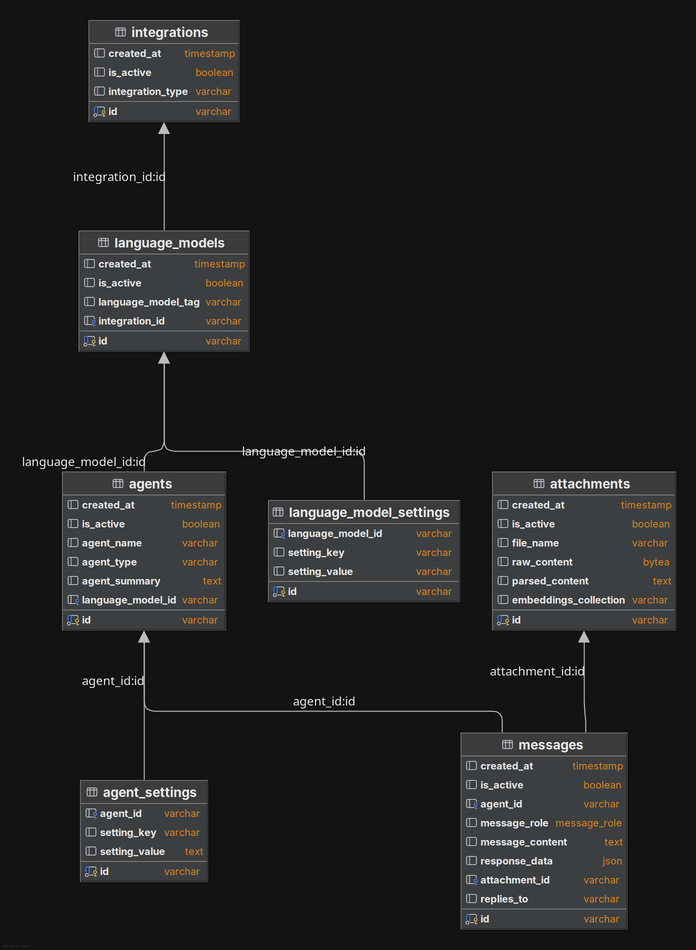

<h2 align="center"><a href="https://github.com/bsantanna/agent-lab">Agent-Lab | 🤖🧪</a></h2>
<h3 align="center">Development Guide</h3>
---

The goal of this document is to provide a quick introduction for developers.

## Environment Setup

### Create a virtual environment

Create a virtual environment to isolate the dependencies:

```bash
python -m venv venv
source venv/bin/activate  # On Windows: venv\Scripts\activate
```

### Install dependencies

After activating the virtual environment, install the dependencies:

```bash
pip install -r requirements.txt
```

### Copy the example environment file
Copy the example environment file to `.env` and adjust the settings as needed:

```bash
cp .env.example .env
```

### Run tests

Run the tests to make sure everything is working as expected:

```bash
make test
```

### Initialize pre-commit

If you plan to contribute to the codebase, it is recommended to install the pre-commit hooks:

```bash
pre-commit install
```

---

## Running the Application

### Locally

```bash
uvicorn app.main:app --reload
```

Access the interactive documentation (OpenAPI):

- Swagger UI: [http://127.0.0.1:8000/docs](http://127.0.0.1:8000/docs)

---

## Project Structure

```plaintext
/
├── app
│   ├── application
│   ├── core
│   ├── domain
│   ├── infrastructure
│   ├── interfaces
│   ├── middleware
├── tests
    ├── integration
```

---

## Project Database Structure



---
