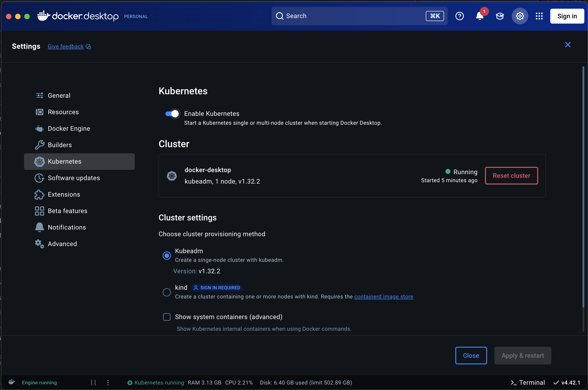
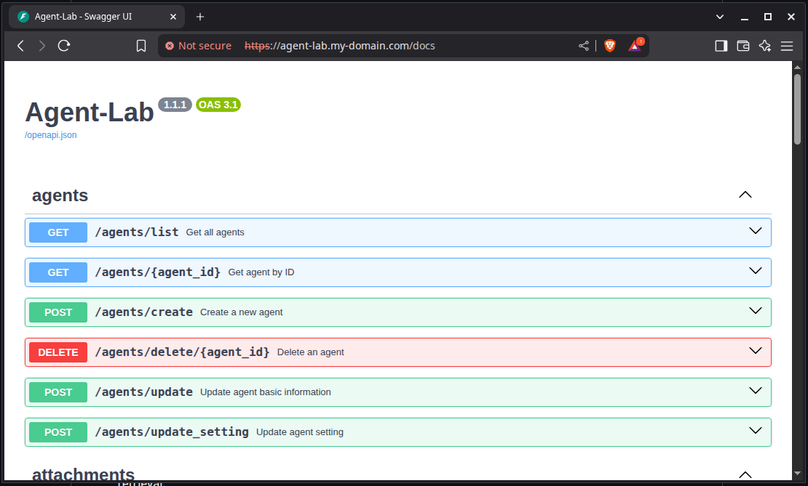

<h2 align="center"><a href="https://github.com/bsantanna/agent-lab">Agent-Lab | 🤖🧪</a></h2>
<h3 align="center">Setup</h3>

---

#### Table of Contents

- [Introduction](#introduction)
- [Prerequisites](#prerequisites)
- [Setup Kubernetes Cluster](#setup-kubernetes-cluster)
- [Setup Dependencies](#setup-dependencies)
- [Deploy Agent-Lab](#deploy-agent-lab)

---

## Introduction

Agent-Lab provides Terraform scripts to deploy the application and its dependencies on Kubernetes clusters.

In this document, we will cover an example deployment of Agent-Lab on Kubernetes using the provided Terraform scripts.

---

## Prerequisites

The following tools must be installed on your machine:

- [Terraform](https://developer.hashicorp.com/terraform/install) — used to deploy all components
- [kubectl](https://kubernetes.io/docs/tasks/tools/) — used to interact with the Kubernetes cluster
- [jq](https://jqlang.github.io/jq/download/) — used in some post-deployment commands

---

## Setup Kubernetes Cluster

### Setup for Linux Users

**Note**: In this reference documentation, a [Minikube](https://minikube.sigs.k8s.io/docs/) cluster is used, in a real scenario you should use a production-ready Kubernetes cluster.

#### Setup Kubernetes Cluster with Minikube

This section describes how to setup a Kubernetes cluster with the necessary resources for running Agent-Lab and its dependencies.

1. Minikube cluster with sufficient resources. The following command allocates 20GB of memory and 4 CPUs to the Minikube VM:

```bash
minikube start --memory=20g --cpus=4
```

#### Setup Networking

Obtain minikube vm ip address:

```bash
minikube ip
# 192.168.49.2
```

After the domain names are determined, modify system hosts file to include domains assigned to minikube vm ip address:
```txt

192.168.49.2 vault.my-domain.com kibana.my-domain.com elasticsearch.my-domain.com agent-lab.my-domain.com

```

### Setup for Docker Desktop Users (Mac / Windows)

**Note**: In this reference documentation, a [Docker Desktop](https://docs.docker.com/desktop/features/kubernetes/) cluster is used, in a real scenario you should use a production-ready Kubernetes cluster.

#### Enable Kubernetes on Docker Desktop

<div align="center">



</div>

---

## Setup Dependencies


#### Install Traefik Ingress Controller

```bash
cd terraform/01_traefik/
terraform init
terraform apply
```

#### Setup Networking

Modify system hosts file to include domains assigned to localhost address:
```txt

127.0.0.1 vault.my-domain.com kibana.my-domain.com elasticsearch.my-domain.com agent-lab.my-domain.com

```

### Setup Cert Manager

To manage TLS certificates, we will use the [cert-manager](https://cert-manager.io/docs/). This tool automates the management and issuance of TLS certificates.

```bash
cd terraform/02_cert-manager/
terraform init
terraform apply
```

And Create a ClusterIssuer for Let's Encrypt production:

```bash
cd terraform/03_cert-cluster-issuer/
terraform init
terraform apply
```

### Setup Redis Operator

Redis is used by Agent-Lab for pub/sub status updates for long operations.

```bash
cd terraform/04_redis-operator/
terraform init
terraform apply
```

### Setup PostgreSQL Operator

PostgreSQL is used by Agent-Lab to store relational data, vector search and dialog memory (checkpointer).
Please refer to [Entity Domain Model](DOMAIN.md) for more details about the data model.

```bash
cd terraform/05_postgres-operator/
terraform init
terraform apply
```

### Setup Keycloak

[Keycloak](https://www.keycloak.org/operator/installation#_installing_by_using_kubectl_without_operator_lifecycle_manager) is used by Agent-Lab to manage user authentication.

```bash
cd terraform/06_keycloak-operator/
terraform init
terraform apply
```

```bash
cd terraform/10_keycloak-instance/
terraform init
terraform apply
```

Please refer to [Keycloak guide](KEYCLOAK.md) for detailed steps how setting up OIDC connection.

### Setup Vault

[Vault](https://developer.hashicorp.com/vault/docs) is used by Agent-Lab to manage secrets and sensitive data.

```bash
cd terraform/08_vault-instance/
terraform init
terraform apply
```

1. Initialize Vault cluster:

```bash
kubectl --namespace vault exec vault-0 -- vault operator init \
    -key-shares=1 \
    -key-threshold=1 \
    -format=json > cluster-keys.json
```

2. Unseal Vault cluster:

```bash
export VAULT_UNSEAL_KEY=$(jq -r ".unseal_keys_b64[]" cluster-keys.json)
kubectl --namespace vault exec vault-0 -- vault operator unseal $VAULT_UNSEAL_KEY
```

### Setup LangWatch

[LangWatch](https://langwatch.ai) is used by Agent-Lab for observability of LLM usage and simulation testing.

Please determine a <langwatch_fqdn> for accessing LangWatch web UI, example: langwatch.my-domain.com

```bash
cd terraform/09_langwatch-instance/
terraform init
terraform apply
```

### Setup Elastic Kubernetes Cluster (ECK) for Observability

This section describes how to setup an Elastic Kubernetes Cluster (ECK) for observability purposes, including logging and monitoring, while it is not strictly necessary for running Agent-Lab, it is highly recommended to have a proper observability stack in place.

```bash
cd terraform/07_elastic-operator/
terraform init
terraform apply
```

```bash
cd terraform/11_elastic-instance/
terraform init
terraform apply
```

Use the following command to obtain `elastic` user password:

```bash
echo "$(kubectl --namespace elastic get secret elasticsearch-es-elastic-user -o=jsonpath='{.data.elastic}' | base64 --decode)"
```

Take note of APM Access Token, it is used in the next step to configure OpenTelemetry Collector.
```bash
echo "$(kubectl --namespace elastic get secret/elastic-eck-apm-server-apm-token \
    -o go-template='{{index .data "secret-token" | base64decode}}')"
```

### Setup OpenTelemetry Collector

```bash
cd terraform/12-otel-instance/
terraform init
terraform apply
```

---

## Deploy Agent-Lab

### Setup Auth Realm

```bash
cd terraform/13_agent-lab-auth-realm/
terraform init
terraform apply
```

### Setup runtime dependencies

```bash
cd terraform/14_agent-lab-dependencies/
terraform init
terraform apply
```

### Deploy Agent-Lab Instance

```bash
cd terraform/15_agent-lab-instance/
terraform init
terraform apply
```

<div align="center">



</div>


---
